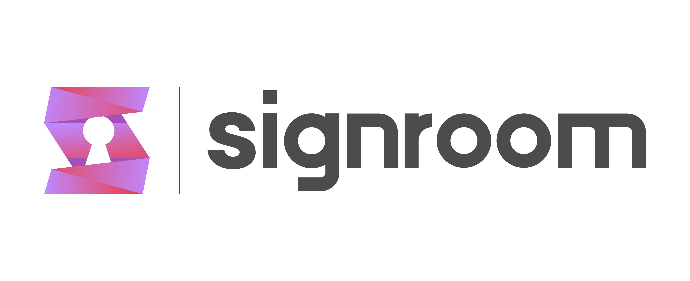
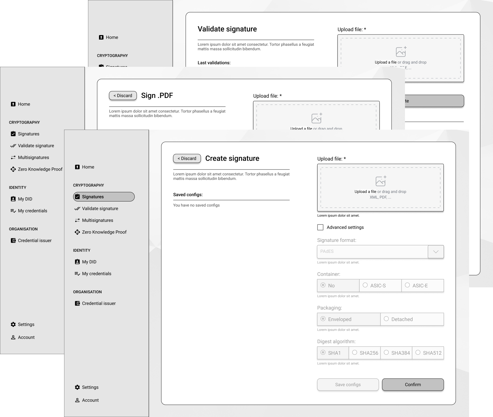

<div align="center">



# Advanced electronic signature service based on [Zenroom](https://zenroom.org/)

</div>

<div align="center">


<br><br><br><br>
</div>


<p align="center">
  <a href="https://dyne.org">
    
  </a>
  <br><br><br><br>
</p>


## Signroom Features and Tech Stack

Signroom is generated using the [Starters](https://github.com/dyne/starters) templating framework see the updated feature list and the tech stack there.

## Document signing

- [x] Cades
- [x] Xades
- [x] Pades
- [ ] Jades
- [x] Secure
- [x] As a service

## Identity, Credential and cryptography

- [x] W3C-DID identity, based on [Dyne.org W3C-DID method](https://github.com/dyne/w3c-did)
- [x] W3C-VC: issueing and verification of credentials, via Web GUI and API

## Cryptography powered by [Zenroom](https://zenroom.org/): 
- [x] Zero knowledge proof (Coconut, BBS)
- [x] Homomorphic multisignature based on [Reflow](https://arxiv.org/abs/2105.14527)
- [x] Cryptographic signatures (ECDSA, EDDSA, Schnorr, BBS, Ethereum signatures)  
- [x] Quantum proof cryptography (Dilithium, Kyber, NTRUP)

## Modularity
- [x] Expandable via no-code/low-code Web GUI, via the Admin Control Panel
- [x] Cryptography, computing and interoperability flows can be added using [Zenroom](https://zenroom.org/) and [Restroom-mw](https://dyne.org/restroom-mw/#/)
- [x] Pluggable to an external service via [Zenswarm](https://github.com/dyne/zenswarm-oracle/) 


## Alpha Deployment

### [Signroom](https://beta.signroom.io/) 
- user: **test2@test2.com** pass: **test2@test2.com**

### [Signroom Admin Control Panel](https://admin.signroom.io/_) 
- (coming soon)

### [DSS backend](http://dss.forkbomb.eu:8080/services/)

-------------------

### 🚩 Table of Contents

- [🎮 Quick start](#-quick-start)
- [💾 Build](#-build)
- [🐋 Docker](#-docker)
- [🐝 API](#-api)
- [🔧 Configuration](#-configuration)
- [📋 Testing](#-testing)
- [🐛 Troubleshooting & debugging](#-troubleshooting--debugging)
- [😍 Acknowledgements](#-acknowledgements)
- [🌐 Links](#-links)
- [👤 Contributing](#-contributing)
- [💼 License](#-license)

</div>

***
## 🎮 Quick start

To start using Signroom run the following command in the root folder

```bash
docker compose up --build
```

After docker compose is done, in the bottom of the terminal you should read something like: 

```bash
signroom-fe-1  |   ➜  Local:   http://localhost:4173/
signroom-fe-1  |   ➜  Network: http://192.168.0.233:4173/
signroom-fe-1  |   ➜  Network: http://172.21.0.1:4173/
```

Then point your browser to `http://localhost:4173` (currently it only works in localhost)

**[🔝 back to top](#toc)**

***
## 💾 Build

(Development only) builds and launches the `webapp` and `webapp`, requires **node >= 16** 

1. `git clone https://github.com/ForkbombEu/signroom/`
1. `cd signroom`
1. `git submodule update --init --recursive`
1. `make up`

**Note**: in order to get app working, database basic configuration is required (info coming soon).

### DSS backend
Download the DSS backend from [here](https://ec.europa.eu/digital-building-blocks/wikis/display/DIGITAL/Digital+Signature+Service+-++DSS)

to run it in linux

```bash
chmod +x apache-tomcat-8.5.85/bin/*.sh
CATALINA_HOME=$PWD/apache-tomcat-8.5.85 ./apache-tomcat-8.5.85/bin/catalina.sh run
```

point your browser to http://localhost:8080

**[🔝 back to top](#toc)**


***
## 🐋 Docker

Coming soon 


**[🔝 back to top](#toc)**

***
## 🐝 API

Coming soon 
<!---
### POST /token

Execute a transaction with some amount

**Parameters**

|          Name | Required |  Type   | Description       | 
| -------------:|:--------:|:-------:| ------------------|
|       `token` | required | string  | Type of token. Accepted values `idea` or `strength`  |
|       `amount`| required | number  | Transaction's token amount |
|       `owner` | required | ULID    | The ULID of the Agent's owner |
 
### GET /token/${request.token}/${request.owner}

Retrieves the actual value of the token type for the specified owner

-->

**[🔝 back to top](#toc)**

***
## 🔧 Configuration

**[🔝 back to top](#toc)**

***

## 📋 Testing

**[🔝 back to top](#toc)**

***
## 🐛 Troubleshooting & debugging

**[🔝 back to top](#toc)**

***
## 😍 Acknowledgements

<a href="https://dyne.org">
  
</a>

Copyleft (ɔ) 2022 by [Dyne.org](https://www.dyne.org) foundation, Amsterdam

Designed, written and maintained by Puria Nafisi Azizi.

Special thanks to Mr. W. White for his special contributions.

### Grants
Software written with the contribution of [NGI Assure](https://nlnet.nl/project/Signroom/#ack) program run by [NLNet](https://nlnet.nl/project/Signroom/#ack):

<a href="https://nlnet.nl/">
  <br><br><br><br>
</a>


<a href="https://nlnet.nl/">
  <br><br><br>
</a>


**[🔝 back to top](#toc)**

***
## 🌐 Links

[Shared docs](https://cloud.dyne.org/s/iaQcPH7EFBgTm3m)
[Starter template](https://github.com/dyne/starters)
[Figma wireframes](https://www.figma.com/file/pdwfO3dMKtaCAQakht0JE6/SignRoom---Dyne.org?type=design&node-id=0%3A1&t=fkIuUXwh1D3gSznY-1)

**[🔝 back to top](#toc)**

***
## 👤 Contributing

1.  🔀 [FORK IT](../../fork)
2.  Create your feature branch `git checkout -b feature/branch`
3.  Commit your changes `git commit -am 'Add some fooBar'`
4.  Push to the branch `git push origin feature/branch`
5.  Create a new Pull Request
6.  🙏 Thank you


**[🔝 back to top](#toc)**

***
## 💼 License
    Signroom - Advanced electronic signature service based on Zenroom
    Copyleft (ɔ) 2022 Dyne.org foundation

    This program is free software: you can redistribute it and/or modify
    it under the terms of the GNU Affero General Public License as
    published by the Free Software Foundation, either version 3 of the
    License, or (at your option) any later version.

    This program is distributed in the hope that it will be useful,
    but WITHOUT ANY WARRANTY; without even the implied warranty of
    MERCHANTABILITY or FITNESS FOR A PARTICULAR PURPOSE.  See the
    GNU Affero General Public License for more details.

    You should have received a copy of the GNU Affero General Public License
    along with this program.  If not, see <http://www.gnu.org/licenses/>.

**[🔝 back to top](#toc)**
